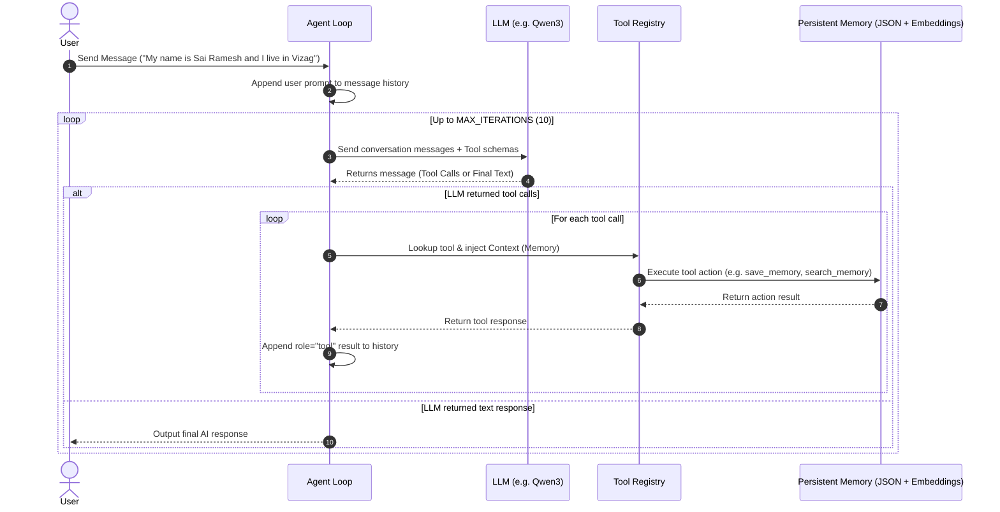
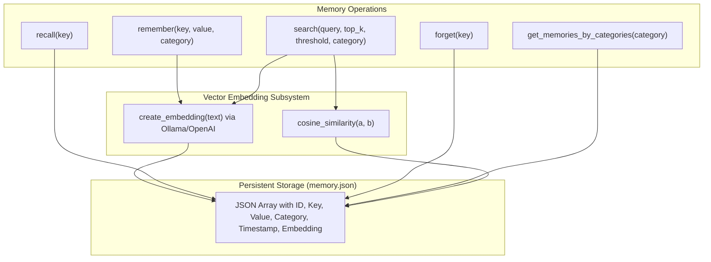

# AI Agent with Hybrid Persistent Vector Memory

A fully autonomous, tool-calling AI agent framework **built entirely from scratch in pure Python** with **zero reliance on heavyweight third-party frameworks** (no LangChain, CrewAI, LlamaIndex, or AutoGen). Powered by local LLMs via Ollama (or any OpenAI-compatible API), this project implements every core agentic primitive from the ground up: dynamic reflection-based JSON schema generation from native Python type hints, seamless runtime context and dependency injection, and a persistent hybrid memory system combining dense vector semantic search with categorized exact key-value retrieval.

---

## Table of Contents

- [Overview](#overview)
- [Key Features](#key-features)
- [Architecture & Flow](#architecture--flow)
- [Project Structure](#project-structure)
- [Prerequisites & Setup](#prerequisites--setup)
- [Quickstart Guide](#quickstart-guide)
- [Core Components](#core-components)
  - [1. Agent Orchestrator (`Agent`)](#1-agent-orchestrator-agent)
  - [2. Hybrid Memory System (`Memory`)](#2-hybrid-memory-system-memory)
  - [3. Dynamic Tool Interface (`Tool`)](#3-dynamic-tool-interface-tool)
- [Memory Taxonomy & Best Practices](#memory-taxonomy--best-practices)
- [Built-in Tools Reference](#built-in-tools-reference)
- [Extending the Agent (Creating Custom Tools)](#extending-the-agent-creating-custom-tools)
- [License & Contributing](#license--contributing)

---

## Overview

This project implements a fully self-contained Agentic AI loop without heavyweight third-party agent frameworks (e.g. LangChain, CrewAI). It demonstrates how to build:

1. **Tool Use & Function Calling**: LLM-driven multi-step tool execution with cycle limits and error boundaries.
2. **Dynamic Schema Reflection**: Automatic generation of OpenAI-compatible function schemas from Python type annotations (including `typing.Literal` to JSON `enum`).
3. **Context / Dependency Injection**: Automatically passes internal system state (such as the persistent `Memory` instance) into tool functions without exposing them to the LLM's arguments.
4. **Persistent Long-Term Vector Memory**: A JSON-backed store that persists across sessions, computes embeddings via embedding models, and enables both semantic similarity search and exact key recall.

---

## Key Features

- **Autonomous Execution Loop**: Handles multi-turn tool calling until a final answer is generated (up to a configurable maximum iteration limit).
- **Reflection-based Tool Schemas**: No manual JSON schema writing. Decorated/wrapped Python functions are converted into JSON schemas dynamically.
- **Smart Context Injection**: Tools declaring a `memory` parameter automatically receive the agent's memory instance at runtime.
- **Hybrid Retrieval**:
  - **Vector Semantic Search**: Cosine similarity against stored dense embeddings with configurable thresholds (`threshold=0.55`).
  - **Exact Key Recall**: High-precision O(1) recall for known keys.
  - **Category-based Filtering**: Partition memories by logical categories (`identity`, `preference`, `personal`, `context`, `other`).
- **Session Persistence**: Memory automatically reads from and writes to `memory.json`.
- **Local LLM First**: Pre-configured for Ollama (`qwen3:4b` / `Qwen3-Embedding:4B`), but fully compatible with any OpenAI API endpoint.

---

## Architecture & Flow

### Agent Execution Lifecycle



### Memory Architecture



---

## Project Structure

```text
.
├── agent.ipynb             # Interactive Jupyter Notebook containing full implementation
├── memory.json             # Persistent JSON storage for agent memory & embeddings
├── requirements.txt        # Python package dependencies
├── .env.example            # Environment template for API keys & endpoints
├── docs/                   # Extended architectural & subsystem documentation
│   ├── ARCHITECTURE.md     # Deep dive into agent loop & reflection system
│   └── MEMORY_SYSTEM.md    # Memory taxonomy, embedding maths & search mechanics
└── README.md               # Main repository documentation
```

---

## Prerequisites & Setup

### 1. Prerequisites

- **Python 3.10+**
- **Ollama** installed and running locally ([ollama.com](https://ollama.com))

### 2. Pull Required Models

Pull the default chat and embedding models in Ollama:

```bash
# Chat / Reasoning model
ollama pull qwen3:4b

# Dense Embedding model
ollama pull Qwen3-Embedding:4B
```

*(Note: You can swap these models with any model supported by Ollama, such as `llama3.2`, `mistral`, or `nomic-embed-text`)*.

### 3. Install Python Dependencies

```bash
# Create and activate a virtual environment
python -m venv .venv
source .venv/bin/activate   # On Windows: .venv\Scripts\activate

# Install requirements
pip install -r requirements.txt
```

### 4. Configure Environment (Optional)

Create a `.env` file if connecting to remote endpoints or customizing ports:

```ini
OPENAI_BASE_URL="http://localhost:11434/v1"
OPENAI_API_KEY="ollama"
MODEL_NAME="qwen3:4b"
EMBEDDING_MODEL_NAME="Qwen3-Embedding:4B"
```

---

## Quickstart Guide

### Running via Jupyter Notebook

Open and run [`agent.ipynb`](file:///d:/Agent/agent.ipynb) in your preferred environment (VS Code, Cursor, or JupyterLab):

```bash
jupyter notebook agent.ipynb
```

Execute cells sequentially:
1. Imports & Client initialization
2. `Memory`, `Tool`, and `Agent` class definitions
3. Tool registrations (`calculator`, `greet`, `time`, memory tools)
4. Interactive `while True` loop cell to chat with the agent!

### Interactive Chat Example

```text
You: My name is Sai Ramesh and I work as an AI Engineer in Vizag.
TOOL CALLED: save_memory
TOOL CALLED: save_memory
AI: Nice to meet you, Sai Ramesh! I've noted that you work as an AI Engineer and live in Vizag.

You: What do you remember about where I live?
TOOL CALLED: search_memory
AI: You live in Vizag.

You: What's the current time and what is 144 / 12?
TOOL CALLED: get_current_time
TOOL CALLED: calculator
AI: The current time is 2026-09-09 10:15:00, and 144 divided by 12 equals 12.
```

---

## Core Components

### 1. Agent Orchestrator (`Agent`)

The [`Agent`](file:///d:/Agent/agent.ipynb) class drives the ReAct-style loop:
- Maintains message history with system prompts, user queries, assistant replies, and tool outputs.
- Injects a shared context dictionary `{"memory": self.memory}` into every tool call.
- Loops up to `MAX_ITERATIONS` to resolve multi-step tool dependencies before returning a final message to the user.

```python
agent = Agent(
    client=client,
    tool_list=tool_list,
    model="qwen3:4b",
    system_prompt="You are a helpful AI agent with access to tools...",
)
response = agent.run("What is 25 * 4?")
```

---

### 2. Hybrid Memory System (`Memory`)

The [`Memory`](file:///d:/Agent/agent.ipynb) class provides structured, persistent vector + key-value storage:

| Method | Description | Search Strategy |
| :--- | :--- | :--- |
| `remember(key, value, category)` | Upserts memory entry by key, computes dense vector embedding, updates timestamp, and saves to disk. | Exact Key Match / Append |
| `recall(key)` | Retrieves a specific memory value by exact key match. | Exact O(1) Key Lookup |
| `forget(key)` | Deletes a memory item matching the key and syncs to disk. | Exact Key Match |
| `search(query, top_k, threshold, category)` | Compares query embedding against memory embeddings via cosine similarity. | Vector Cosine Similarity |
| `get_memories_by_categories(category)` | Retrieves all memories belonging to a category. | Exact Categorical Filter |
| `list_memories()` | Returns the complete raw memory array. | Full Scan |

#### Memory JSON Schema Sample

```json
[
  {
    "id": 1,
    "key": "name",
    "value": "Sai Ramesh",
    "text": "name : Sai Ramesh",
    "embedding": [-0.000089, 0.021406, -0.026708, ...],
    "category": "identity",
    "timestamp": "2026-09-09 10:00:00"
  }
]
```

---

### 3. Dynamic Tool Interface (`Tool`)

The [`Tool`](file:///d:/Agent/agent.ipynb) class handles dynamic reflection and execution:
- **`generate_parameters(function)`**: Inspects `inspect.signature(function)` and translates Python types (`str`, `int`, `float`, `bool`, and `Literal[...]`) into standard JSON Schema parameters.
- **Context Stripping**: Internal context parameters like `memory` are automatically hidden from the JSON Schema shown to the LLM.
- **Runtime Injection**: During `execute()`, if the target function accepts `memory`, the agent automatically passes `self.context["memory"]`.

```python
from typing import Literal

def calculator(a: float, b: float, operation: Literal["add", "subtract", "multiply", "divide"]):
    """Performs mathematical calculations."""
    if operation == "add": return a + b
    if operation == "subtract": return a - b
    if operation == "multiply": return a * b
    if operation == "divide": return a / b if b != 0 else "Cannot divide by zero"

calculator_tool = Tool(
    function=calculator,
    description="Perform mathematical calculations"
)
```

Generated OpenAI Tool Schema:

```json
{
  "type": "function",
  "function": {
    "name": "calculator",
    "description": "Perform mathematical calculations",
    "parameters": {
      "type": "object",
      "properties": {
        "a": { "type": "number" },
        "b": { "type": "number" },
        "operation": {
          "type": "string",
          "enum": ["add", "subtract", "multiply", "divide"]
        }
      },
      "required": ["a", "b", "operation"]
    }
  }
}
```

---

## Memory Taxonomy & Best Practices

The agent prompt is tuned to classify stored memories into 5 distinct categories:

| Category | Purpose | Examples |
| :--- | :--- | :--- |
| `identity` | Core identification attributes | Full name, age, gender, occupation, language |
| `preference` | Likes, dislikes, favorite items, styles | Favorite food, preferred programming language, IDE theme |
| `personal` | Biographical facts and background | Hometown, alma mater, family details, pet names |
| `context` | Ephemeral or active context | Current project name, daily goals, active sprint |
| `other` | Miscellaneous information | Notes or details that do not fit into the standard categories |

### Memory Routing Rules

1. **Exact Key Known**: When the exact key is known, use `recall_tool`.
2. **Broad User Knowledge Queries**: For queries like *"What do you know about me?"*, the agent uses `get_all_memories_tool` or `get_memories_by_category_tool`.
3. **Semantic Inquiries**: When asking conceptual questions with uncertain keys, the agent calls `search_memory_tool` with similarity scoring.
4. **Deletion Safety**: To forget a fact, the agent first queries `search_memory` to locate the exact key, then executes `forget_memory` with the confirmed key.

---

## Built-in Tools Reference

| Tool Name | Underlying Function | Description |
| :--- | :--- | :--- |
| `calculator_tool` | `calculator(a, b, operation)` | Evaluates basic arithmetic operations (`add`, `subtract`, `multiply`, `divide`). |
| `time_tool` | `get_current_time()` | Returns the current system date and timestamp. |
| `greet_tool` | `greet(name, age, excited)` | Generates a customizable greeting string. |
| `memory_tool` | `save_memory(memory, key, value, category)` | Upserts a categorized memory into long-term storage. |
| `recall_tool` | `recall_memory(memory, key)` | Retrieves a stored memory value by exact key match. |
| `forget_tool` | `forget_memory(memory, key)` | Removes a memory entry by exact key match. |
| `search_memory_tool` | `search_memory(memory, query, category)` | Semantic vector similarity search over memory items. |
| `memory_by_category_tool` | `get_memories_by_category(memory, category)` | Retrieves all memories stored within a specific category. |
| `get_all_memories_tool` | `get_all_memories(memory)` | Returns all stored memories across all categories. |

---

## Extending the Agent (Creating Custom Tools)

Adding new tools requires only standard Python functions with type annotations:

```python
import requests
from typing import Literal

def fetch_weather(city: str, unit: Literal["celsius", "fahrenheit"] = "celsius") -> str:
    """Fetch weather information for a given city."""
    # Custom API or scraper implementation
    return f"The weather in {city} is 28° {unit} with clear skies."

# Wrap with Tool
weather_tool = Tool(
    function=fetch_weather,
    description="Fetches current weather for a specified city in celsius or fahrenheit."
)

# Add to tool_list
tool_list.append(weather_tool)
```

The agent will automatically generate the schema, make the tool available to the LLM, and execute it upon request.

---

## Documentation

For in-depth guides, refer to the `docs/` folder:
- [Architecture & Execution Subsystem](docs/ARCHITECTURE.md)
- [Memory Subsystem & Vector Search](docs/MEMORY_SYSTEM.md)

---

## Contributing & License

Contributions, issues, and feature requests are welcome!
Feel free to submit a pull request or open an issue for new tools, memory backends (e.g. SQLite, ChromaDB, PGVector), or UI integrations.
