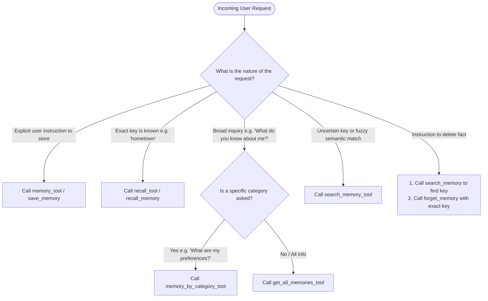

# Hybrid Vector & Categorical Memory System 🧠

This document details the design, mathematical foundations, data structure, and search algorithms of the agent's persistent memory subsystem.

---

## 1. System Overview

Traditional conversational agents suffer from context window limitations and statelessness across executions. The `Memory` module provides:
- **Persistent Storage**: Serialized to `memory.json` with disk synchronization.
- **Categorical Partitioning**: Classification into discrete namespaces (`identity`, `preference`, `personal`, `context`, `other`).
- **Dense Vector Search**: Semantic similarity matching using embeddings generated via Ollama (`Qwen3-Embedding:4B`).
- **Exact Key Recall & Upsert**: Idempotent key-based storage to prevent unbounded duplicate growth.

---

## 2. Memory Record Structure

Each memory record is represented as an item in `memory.json`:

```json
{
  "id": 1,
  "key": "location",
  "value": "Vizag",
  "text": "location : Vizag",
  "embedding": [
    -0.00008978384,
    0.021406086,
    -0.026708579,
    0.04625235,
    ...
  ],
  "category": "personal",
  "timestamp": "2026-09-09 10:05:30"
}
```

### Fields Specification:

- `id` (*int*): Auto-incrementing primary key.
- `key` (*str*): Unique semantic identifier for the fact (e.g. `"hometown"`, `"favourite_food"`).
- `value` (*str*): The stored value or description.
- `text` (*str*): Standardized text representation `"<key> : <value>"` used as the input to the embedding model.
- `embedding` (*List[float]*): Dense vector output generated from `text`.
- `category` (*str*): Logical classification (`identity`, `preference`, `personal`, `context`, `other`).
- `timestamp` (*str*): ISO-like formatted date-time string marking creation or latest update.

---

## 3. Mathematical Principles & Similarity Search

### 3.1 Cosine Similarity Formulation

To match a user's natural language query with relevant memories, the system computes the cosine similarity between the query embedding vector $\mathbf{a}$ and the stored record embedding vector $\mathbf{b}$:

$$\text{Cosine Similarity}(\mathbf{a}, \mathbf{b}) = \frac{\mathbf{a} \cdot \mathbf{b}}{\|\mathbf{a}\| \|\mathbf{b}\|} = \frac{\sum_{i=1}^n a_i b_i}{\sqrt{\sum_{i=1}^n a_i^2} \sqrt{\sum_{i=1}^n b_i^2}}$$

### 3.2 Threshold Filtering

Matches below a configurable similarity score threshold (default: `0.55`) are filtered out to reduce false-positive retrievals:

```python
def cosine_similarity(a, b):
    a = np.array(a)
    b = np.array(b)
    return np.dot(a, b) / (np.linalg.norm(a) * np.linalg.norm(b))
```

---

## 4. Operational Workflows

### 4.1 Upsert & Key Deduplication (`remember`)

```
                  +--------------------------------+
                  | remember(key, value, category) |
                  +--------------------------------+
                                  |
                                  v
                  +--------------------------------+
                  | Compute embedding for text     |
                  +--------------------------------+
                                  |
               +------------------+------------------+
               |                                     |
               v (Key already exists)                v (New Key)
    +-------------------------+            +-------------------------+
    | Update existing record  |            | Append new memory record|
    | (value, embedding, time)|            | with next_id            |
    +-------------------------+            +-------------------------+
               |                                     |
               +------------------+------------------+
                                  |
                                  v
                  +--------------------------------+
                  | Save to disk (memory.json)     |
                  +--------------------------------+
```

### 4.2 Query Workflow (`search`)

1. User prompt or agent triggers a search for `"What food do I enjoy?"`.
2. Generate query embedding vector $\mathbf{q}$.
3. Iterate over active memories:
   - If category is specified, skip non-matching categories.
   - Compute similarity score $s = \text{cosine\_similarity}(\mathbf{q}, \mathbf{m}_i)$.
   - If $s \ge \text{threshold}$, include candidate in results.
4. Sort matching records by score in descending order.
5. Return top $k$ items (`top_k = 3`).

---

## 5. Memory Routing Decision Tree


